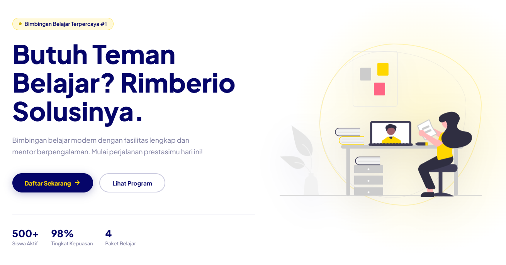

# 🎓 Rimberio Bimbel — Modern Tutoring Landing Page

**Rimberio Bimbel** adalah website landing page premium untuk institusi bimbingan belajar yang dirancang dengan estetika modern, performa tinggi, dan pengalaman pengguna yang mulus. Proyek ini dibangun menggunakan teknologi web murni (Vanilla) untuk memastikan kecepatan akses maksimal.

---

## 📸 Preview & Snapshot

---

## ✨ Fitur Unggulan

Proyek ini bukan sekadar landing page biasa. Berikut adalah fitur-fitur teknis yang diimplementasikan:

- 🌓 **Smart Dual Mode**: Perpindahan antara mode *Light* dan *Dark* yang cerdas dengan sinkronisasi preferensi sistem dan penyimpanan lokal (`localStorage`).
- 📱 **Fully Responsive Adaptive Layout**: Desain yang dioptimalkan secara mendalam menggunakan sistem *Consolidated Media Queries* untuk tampilan sempurna di desktop, tablet, hingga smartphone.
- 💬 **Dynamic Testimonial Engine**: Slider testimoni terkini yang ditenagai oleh JavaScript dinamis dengan fitur *auto-play* dan kontrol interaktif.
- 📝 **Advanced Registration Form**:
  - Validasi *real-time* untuk keamanan data.
  - **Custom Dropdown Component**: Pilihan paket belajar dengan komponen dropdown buatan sendiri (bukan bawaan browser) untuk estetika yang konsisten.
  - Penangan pesan sukses menggunakan sistem **Toast Notification**.
- 🚀 **Performance Optimized**:
  - **Clean & DRY Code**: Semua gaya CSS didefinisikan menggunakan *CSS Variables*.
  - **Global Error Handling**: Penanganan otomatis untuk kegagalan pemuatan gambar menggunakan inisial nama.
  - **Smooth Reveal Animations**: Efek kemunculan elemen saat di-scroll menggunakan `Intersection Observer API`.

---

## 🛠️ Teknologi yang Digunakan

Proyek ini dibangun dengan pendekatan **Vanilla Web Stack** untuk performa tanpa kompromi:

- **HTML5**: Struktur semantik yang ramah SEO dan aksesibel.
- **Vanilla CSS3**: Menggunakan arsitektur *Variable-based* dan *Flexbox/Grid* modern tanpa framework eksternal.
- **Vanilla JavaScript (ES6+)**: Logika interaktif murni tanpa beban *library* tambahan seperti jQuery.

---

## 💡 Filosofi Desain

Rimberio Bimbel mengusung palet warna **Navy Blue & Gold** yang melambangkan kepercayaan, profesionalisme, dan prestasi. Penggunaan tipografi **Plus Jakarta Sans** memberikan kesan modern dan ramah bagi audiens milenial dan Gen Z.

---

## 💻 Kontribusi

Kami sangat menghargai kontribusi Anda! Jika Anda memiliki ide perbaikan atau tambahan fitur:
1. Fork proyek ini.
2. Buat fitur branch baru (`git checkout -b feature/FiturKeren`).
3. Commit perubahan Anda (`git commit -m 'Menambahkan fitur keren'`).
4. Push ke branch tersebut (`git push origin feature/FiturKeren`).
5. Buka Pull Request.

---

  Dibuat dengan ❤️ oleh <strong>Rimberio Team</strong>

